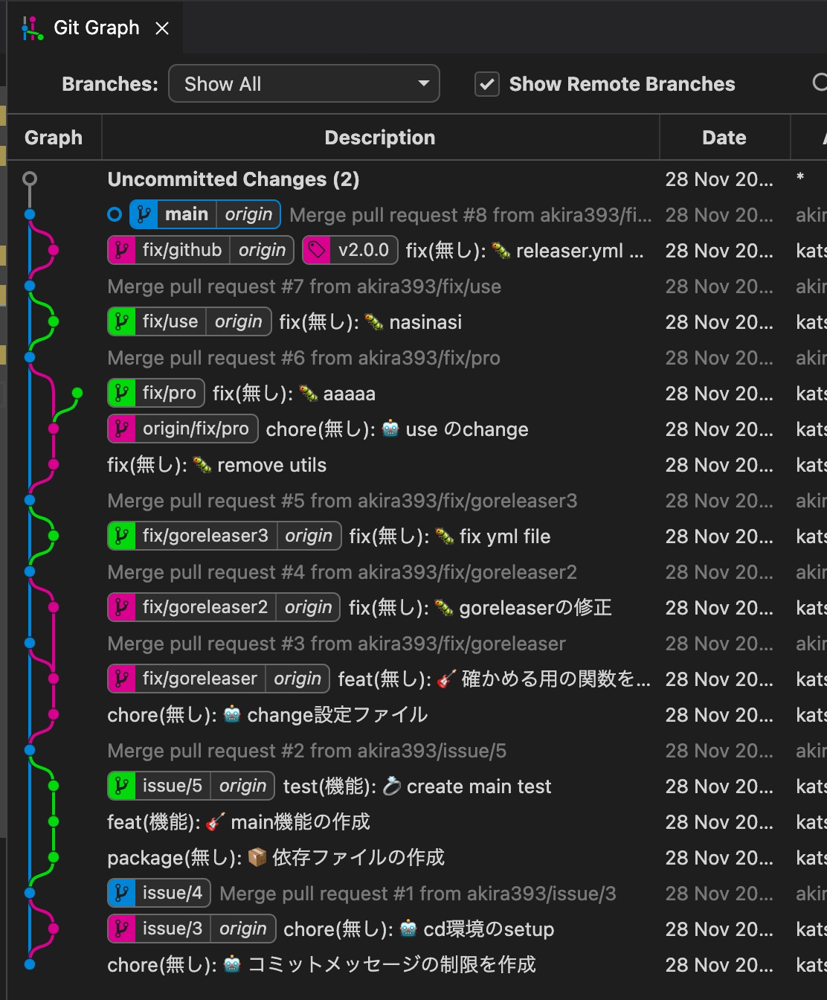
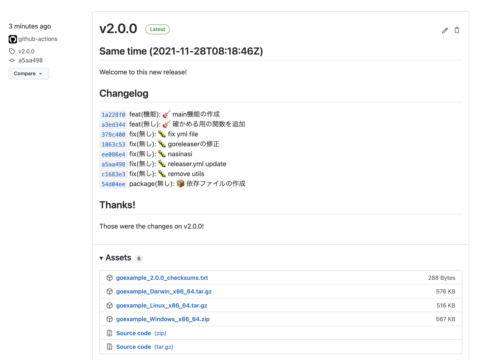

# goexample

goreleaser のリリースを行うexampleリポジトリである。

以下のようなコミットを行い、タグづけを行う



そうすると、[release.yml](.github/workflows/release.yml)と[.goreleaser.yml](.goreleaser.yml)の設定に従い、自動でリリースが行われる。

文章の内容は、[.goreleaser.yml](.goreleaser.yml)で設定される。



## setup

```bash
npm install -g commitizen
npm install -g git-cz
```
